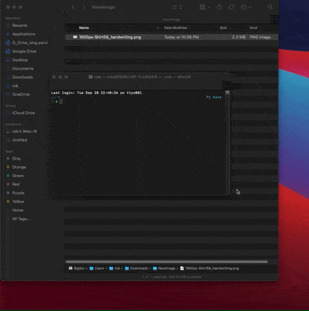

`Photo Transform Application` is the easiest way to import images and slice them in data ready for handwriting OCR machine learning model. 

Designed for Windows and macOS Big Sur.

**Setting up virtual environment**
---

1. Clone this repo on your local machine with GitHub cli 'gh repo clone ___repo name to be determined___'
2. cd into the directory '___repo name to be determined___'
3. Create a `venv` virtual environment in the cloned directory by running 
   `python3 -m venv venv`
4. Activate the environment by running `source /venv/bin/activate`
5. Install the repo by running `pip3 install -r requirements.txt`

**Usage**
---

Simply run `story_photo_transformer.py` file to get started. The Graphical User Interface (GUI) is intuitive. A sample flow of the process is demonstrated below.

**How to Contribute**
---

1. Clone repo and create a new branch: `$ git checkout ___repo name to be determined___ -b name_for_new_branch`.
2. Make changes and test
3. Submit Pull Request with comprehensive description of changes

**Donations**
---

This is free, open-source application. If you'd like to say thanks for this one, you can donate BTC at `___BTC Addres can be inserted here___`.
